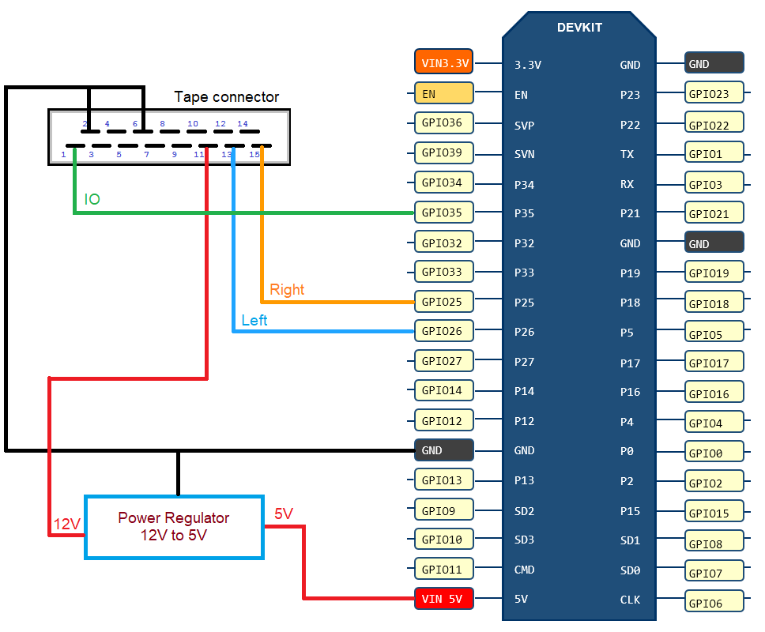

# Mazda Bluetooth Tape Deck Emulator (with an ESP-32)

Its Bluetooth version of the [Krasutski/mazda_tape_deck_emulator](https://github.com/Krasutski/mazda_tape_deck_emulator) with an ESP-32.

## Used Parts

- NodeMCU-ESP-32S
- STPDWN-3P-5V, DC/DC synchronous switching step-down with HX1314G

## Connection diagram



# Installation

1. Install the ESP32-A2DP lib.

```
cd  ~/Documents/Arduino/libraries
git clone https://github.com/pschatzmann/ESP32-A2DP.git
```

3. Compile & Flash the `app.ino` to the ESP-32.
